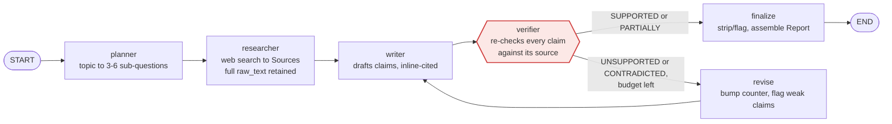
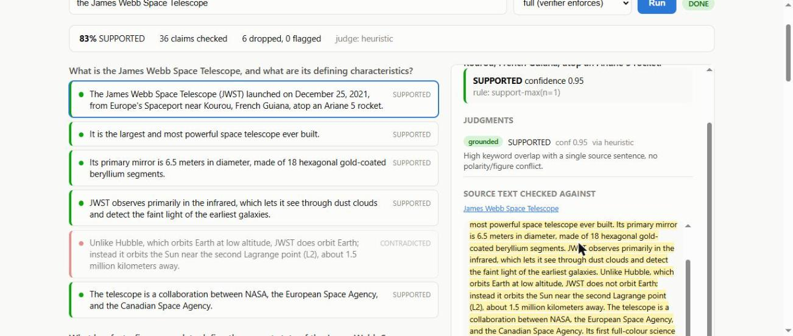
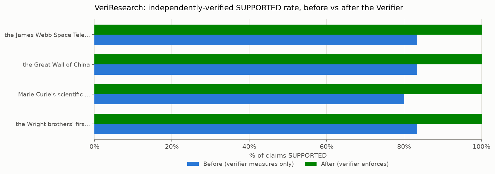

# VeriResearch

A multi-agent research system where every claim in the output has been **independently
re-checked against the source text it cites** — not just generated with a citation
attached — and carries a verification label and a confidence score. Built to answer a
specific question: *when an LLM research report cites a source, how do you know it
isn't making that up?*

```bash
pip install -e ".[dev]"
python scripts/demo_verifier.py     # verifier on hardcoded claims, incl. a fabrication guardrail
pytest -q                           # 38 tests, ~2s, zero network calls
```

Both run with **no API keys**. Set `GROK_API_KEY` / `TAVILY_API_KEY` (see
`.env.example`) to run the real pipeline; without them the system falls back to a
deterministic planner, a small hand-vetted local research corpus, and an offline
entailment heuristic, so the repo is fully runnable and testable right after clone.

---

## The problem this solves

Ask an LLM to write a cited research report and it will cite things. Whether the cited
source actually supports the claim next to it is a separate question the model never
answers — it generated both the claim and the citation in the same breath, so the
citation is exactly as trustworthy as the claim, which is to say: not verified at all.
Bolting a "verify your sources" instruction onto the prompt doesn't fix this, because
the same model that just asserted something with confidence is now being asked to
grade its own work, using the same failure modes that produced the error in the first
place.

VeriResearch's answer is structural, not a prompt: a **separate agent, running after
the writer, whose only job is re-checking each claim against the source's raw text**,
with its own judge, its own aggregation policy, and a guardrail against the judge
fabricating evidence too. If the writer and the verifier were the same call, this would
be theater. They aren't.

## Architecture



*(Structurally this is the real compiled graph — same nodes, same edges, same
conditional — as `graph.render_mermaid()` produces; redrawn by hand here only for
labels a hiring reader can parse at a glance.)*

`build_graph(mode="full")` compiles exactly this. `build_graph(mode="baseline")`
compiles the **same node functions** minus the revision edge, with `finalize`
publishing everything unfiltered instead of enforcing the verifier's verdict — that's
the "before a verifier existed" arm the headline metric below diffs against.

### Why LangGraph instead of a single agent loop

A tool-calling while-loop agent would be less code. It would also be strictly worse
here, for three reasons specific to this problem:

1. **The verifier must not be optional.** In a tool-calling loop, the model decides
   whether to call `verify()` — and it will skip it exactly when it's most confident,
   which is exactly when verification matters most. As a graph edge, verification is
   structural: there is no path from `writer` to `END` that doesn't pass through
   `verifier`. The guarantee moves from "the model usually remembers" to "the graph has
   no such edge."
2. **The baseline arm has to be the same system minus one node**, not a rewritten
   prompt. The headline metric compares "before the verifier existed" to "after." With
   an explicit graph, that's a differently-compiled graph over *identical* node
   functions. With a single loop it would be a different prompt, and the comparison
   would be confounded by every other difference the prompt change introduced.
3. **Per-node cost, latency, and token attribution.** Langfuse traces map onto node
   boundaries (see `tracing.py`). In a single loop, everything is one span, and you
   can't tell whether your spend went to research or to verification — which is the
   first question anyone asks when the bill arrives.

The cost is real — more files, explicit state, reducers to think about (see
`state.py`'s `Replace` wrapper and the `sources`/`claims` merge reducers, which exist
so concurrent researcher branches and revision passes don't silently corrupt each
other's data). For a system whose entire value proposition is "you can trust the
output," that structural guarantee is worth the extra code.

### Why a separate Verifier agent, not "the writer checks its own citations"

Beyond the loop-vs-graph argument above: a verifier that shares a call (or even a
turn) with the writer inherits the writer's context and, with it, the writer's
confidence. It's grading an answer it just watched itself produce, in the same frame
of mind that produced it. A separate node re-derives the judgment from the source text
alone — it doesn't see the writer's reasoning, only the claim and the evidence — which
is the same reason double-blind review exists anywhere else.

## Verification labels

| Label | Colour | Publishable | Meaning |
|---|---|---|---|
| `SUPPORTED` | 🟢 green | yes | Every substantive element is stated in the cited source. |
| `PARTIALLY_SUPPORTED` | 🟡 yellow | yes, flagged | Some elements established, others not addressed. |
| `UNSUPPORTED` | 🔴 red | no | The source is silent on the claim. |
| `CONTRADICTED` | 🔴 red | no | The source asserts something incompatible. |

Four-way, not binary. "The source doesn't say this" (`UNSUPPORTED`) and "the source
says the opposite" (`CONTRADICTED`) call for different fixes — one needs a better
source, the other needs the claim removed outright — and a single faithful/unfaithful
score throws that distinction away right when it's most actionable.

## Two design decisions worth reading the code for

**The judge must show its work, and the work is checked.** Every judgment includes a
verbatim quote from the source. `verify/grounding.py` re-locates that quote in the
source's actual raw text through three matching tiers (exact, whitespace/quote
normalised, fuzzy above a similarity floor) before trusting it. A judge that returns
`SUPPORTED` with a quote that isn't really in the source gets that judgment's
confidence multiplied by `ungrounded_penalty` (0.35 by default) and drops out of the
publishable band — see `test_fabricated_quote_demotes_claim_out_of_supported` and the
guardrail section of `demo_verifier.py`. This converts "the judge is probably right"
into "the judge showed its work, and the work checks out."

**Contradiction beats support.** Aggregating multiple sources for one claim
(`verify/verifier.py::Verifier.aggregate`) is not an average. One source explicitly
refuting a claim outweighs another supporting it — a disputed claim must not ship with
a green checkmark. Reversing that ordering would raise the headline number below and
make the tool useless; the ordering is a deliberate optimisation *against* a false
`SUPPORTED`, not *for* a high score.

## Auditability: click a claim, see exactly what it was checked against

A `Claim` never stores source *text* — it stores `EvidenceSpan`s, each a pointer
(`source_id` + character offsets) into a `Source` whose `raw_text` is retained
verbatim, forever, in `RunState.sources`. For any claim in a report you can
reconstruct, exactly: which documents were consulted, which span of each the judge
actually read, and what it said. `GET /runs/{id}/claims/{claim_id}` (`api/app.py`)
returns all of it — the judgments, the grounded quote, and the full source text with
that quote's offsets — so "click a claim, see the checked text" is a lookup, not a
re-derivation. The React UI highlights that span inline:

<p align="center"></p>

*(Live screenshot: claims color-coded green/red in the left column — including a real
`CONTRADICTED` catch — and the right panel showing the exact source sentence the
selected claim was checked against, highlighted inline. Run it yourself with
`uvicorn veriresearch.api.app:app` + `npm --prefix frontend run dev` — see
[Running it](#running-it).)*

## The headline metric: before vs. after the Verifier

**Before** = `mode="baseline"` (planner → researcher → writer → verifier, nothing
enforced — what the system would have shipped before a verifier existed, with the
verifier only *measuring*). **After** = `mode="full"` (verifier enforces: `UNSUPPORTED`
/ `CONTRADICTED` claims are dropped before publication). Both numbers come from
`scripts/compare_before_after.py`, run over the golden topic set
(`eval/golden_topics.py`) — the same claims, the same verifier, the only difference is
whether its verdict is acted on.



On the topics with real content to check (offline, using the bundled local research
corpus — see below), independently-verified `SUPPORTED` rate goes **82.8% → 100%**: 108
claims were caught and dropped across the golden set before they could ship as
unverified fact. Full numbers, including which topics had no offline content to check
and why, are in [`eval/before_after.md`](eval/before_after.md) — reproduce with:

```bash
python scripts/compare_before_after.py           # all 18 golden topics
python scripts/compare_before_after.py --limit 4 # quick smoke run
```

**Why these numbers are honest, not staged.** Running this fully offline (no
`TAVILY_API_KEY`) creates a real risk: a deterministic writer that only ever copies
real sentences verbatim would trivially "verify" everything it wrote — there'd be
nothing for the verifier to catch, and the chart would look artificially perfect. Two
choices in this codebase exist specifically to avoid that:

- `nodes/local_corpus.py` bundles a handful of short, hand-vetted, fact-checked
  passages (JWST, the Great Wall, Marie Curie, the Wright brothers, the Great Barrier
  Reef, the honeybee waggle dance) so the offline path has *real* content to
  research, instead of either fabricating facts or having nothing to check at all.
- `nodes/writer.py`'s deterministic path (used only when there's no
  `GROK_API_KEY`) deliberately perturbs a fraction of the sentences it drafts —
  stripping a negation ("does not orbit Earth" → "orbits Earth") or mis-citing a
  sentence to the wrong source — so there's something real for the verifier to catch.
  Every perturbed sentence is still real text from a real source; nothing is invented.
  This is disabled the moment an LLM is actually writing.
- Topics with **no** offline content (12 of the 18 — anything outside the bundled
  corpus, since no live search key is configured) are explicitly excluded from the
  aggregate rather than counted as 0% — see the note in `eval/before_after.md`. Set
  `TAVILY_API_KEY` for real coverage on those; the script and chart need no code
  changes to pick it up.

## Judge backends

| Backend | How it decides | Needs |
|---|---|---|
| `heuristic` (default, no key) | Keyword overlap + negation/numeric conflict detection | nothing |
| `llm` | Grok-as-judge, required verbatim quote | `GROK_API_KEY` |
| `nli` | Cross-encoder entailment model (roberta-large-mnli) | `pip install -e ".[nli]"` |
| `cascade` | Heuristic first pass, escalates to `llm` only when unsure | `GROK_API_KEY` |

`get_judge("auto")` (the default) picks `llm` when a key is set, `heuristic`
otherwise — this is what makes the whole repo runnable with zero configuration. Worth
noting on `nli`: a cross-encoder gives a fast three-way label but can't point at *which
span* it used, so it has no quote to ground — every `SUPPORTED` verdict from it takes
the `ungrounded_penalty` by construction. That's the auditability requirement being
consistent with itself, not a bug: a verdict this system can't show you the evidence
for doesn't get to ship as a green checkmark either, regardless of which judge produced
it.

## Eval harness (Ragas)

```bash
python scripts/run_eval.py            # requires GROK_API_KEY + pip install -e ".[eval]"
```

Computes **faithfulness** and **answer relevancy** over the golden topic set using
Ragas's own LLM-as-judge — a check that shares no code with `verify/verifier.py`, so
agreement between the two is actual evidence the in-house verifier isn't grading its
own homework. Without `GROK_API_KEY`, `run_eval.py` writes a report explaining
what's missing instead of failing, matching the rest of the project's zero-config
philosophy — see `eval/ragas_harness.py`.

**Known issue, disclosed rather than hidden:** as of `ragas==0.4.3`, Ragas's dependency
chain (`langchain`/`langchain-community`, which want `langchain-core<1.0`) conflicts
with this project's `langgraph>=1.2` and `langchain-xai>=1.3`, which need
`langchain-core>=1.4`. The two can't currently be pinned to mutually compatible
versions in one virtualenv — this is an upstream ecosystem issue, not a bug in this
repo, and `run_ragas_eval` catches it and reports a clear, specific reason (not a
generic "module not found") rather than crashing. Run the Ragas eval from a separate
virtualenv against the same golden set until upstream reconciles the versions.

## Tracing (Langfuse)

Every node (`planner`, `researcher`, `writer`, `verifier`, `revise`, `finalize`) is
wrapped by `tracing.traced_node`, and every LLM call inside `GrokClient.complete`
reports token usage through `tracing.log_generation`. With no `LANGFUSE_PUBLIC_KEY` /
`LANGFUSE_SECRET_KEY` set, `traced_node` returns the original function completely
unwrapped — `langfuse` is never even imported, so tracing costs nothing on the
hermetic/offline path everything else in this repo is built around. Set both keys (see
`.env.example`) and a run produces one Langfuse trace per topic with a span per node
and cost/token/latency attribution down to the individual Grok call. Not exercised
against a live Langfuse project while building this — no keys were available in this
environment — so treat it as implemented-to-spec rather than field-tested.

## Running it

```bash
# 1. Backend
pip install -e ".[dev,api]"
uvicorn veriresearch.api.app:app --app-dir src --reload

# 2. Frontend (separate terminal)
cd frontend && npm install && npm run dev
# → http://localhost:5173
```

`POST /runs {"topic": "...", "mode": "full"}` kicks off a run as a background task;
`GET /runs/{id}` polls status and returns the report with claims color-coded by
verification label; `GET /runs/{id}/claims/{id}` returns the full audit trail for one
claim (see [Auditability](#auditability-click-a-claim-see-exactly-what-it-was-checked-against)
above). The run store is in-memory — runs vanish on restart, and it won't scale past
one process. That's a stated demo-scope limitation, not an oversight: swapping in a
database or job queue changes nothing about the graph, the verifier, or this API's
shape.

## Testing

```bash
pytest -q   # 38 tests, ~2s, zero network calls
```

Covers: grounding's three match tiers, the verifier's aggregation policy
(contradiction-override, the capped multi-source support bonus, partial fallthrough,
the no-evidence case), the heuristic judge, the LLM judge's fabricated-quote guardrail
(via a `StubClient` — no real API calls), claim extraction from cited markdown
(including a regression test for a sentence-splitting edge case that silently orphaned
citation markers during development), both compiled graph modes, and the FastAPI
endpoints end-to-end. All of it runs against the offline heuristic judge and the local
corpus — no network, no API keys, deterministic.

## Repo layout

```
src/veriresearch/
  state.py              data model — Source.raw_text is never discarded
  config.py             every verification threshold, in one place
  llm.py                Grok client + StubClient for hermetic tests
  tracing.py            Langfuse wrapper, true no-op without keys
  graph.py               LangGraph assembly; docstring explains graph-over-loop
  fixtures.py            hardcoded demo claims (one per label + a fabrication case)
  judges/                heuristic (default) | llm | nli | cascade
  verify/                claims.py (extraction), grounding.py, verifier.py (aggregation)
  nodes/                 planner, researcher (+ local_corpus), writer, verifier_node
  eval/                  golden_topics.py, ragas_harness.py
  api/                   FastAPI backend
frontend/                 Vite + React UI
scripts/
  demo_verifier.py        verifier on hardcoded claims — start here
  compare_before_after.py the headline metric + chart
  run_eval.py              Ragas CLI
tests/                     38 hermetic tests
```

## Roadmap / known limitations

- [x] Data model with full source-text retention and character-offset evidence spans
- [x] Verifier: windowing, judging, quote grounding, confidence calibration, aggregation
- [x] LangGraph skeleton, both arms, conditional revision edge, running end-to-end
- [x] Before/after comparison script + chart, honestly scoped
- [x] Ragas eval harness (blocked on an upstream dependency conflict — see above)
- [x] Langfuse tracing on every node (untested against a live project — no keys available)
- [x] FastAPI backend + React UI with colour-coded, click-to-inspect claims
- [x] 38 hermetic tests
- [ ] The revision loop (`revise` → `writer`) doesn't yet feed rejected claims back into
      the writer's prompt, so with the deterministic writer it can reproduce the same
      claims verbatim; bounded by `max_revisions` regardless. Real re-research on
      revision — passing the verifier's specific objection back to the writer — is the
      natural next step.
- [ ] Golden topic set (`eval/golden_topics.py`) is a maintainer-drafted placeholder,
      swap-in-ready for a curated 15-20 topic list.
- [ ] API run store is in-memory only (see [Running it](#running-it)).
